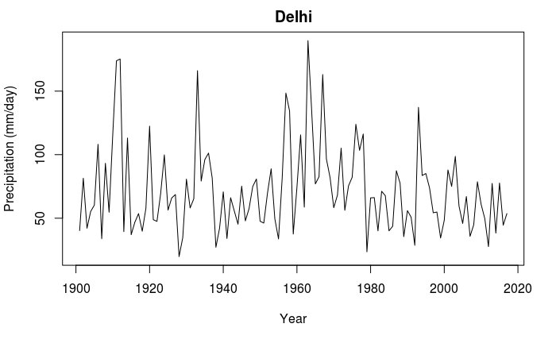
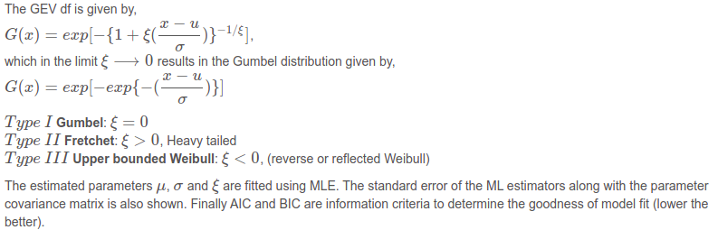
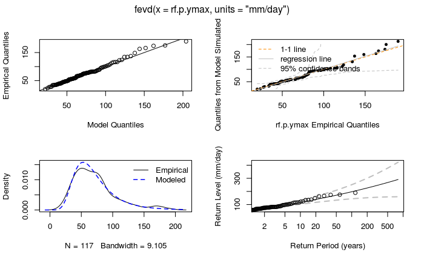
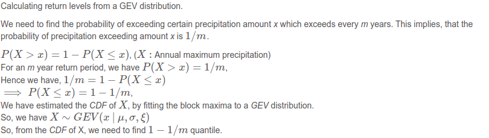
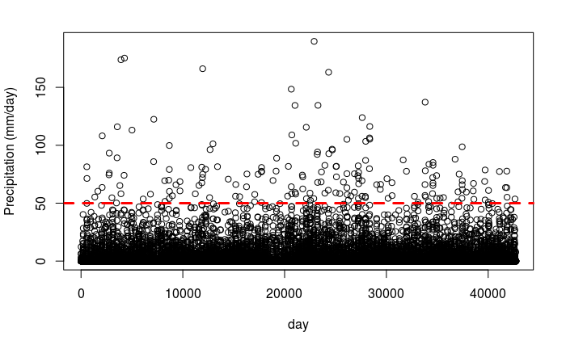
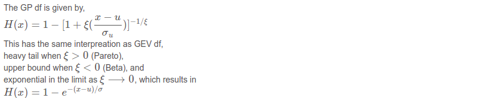
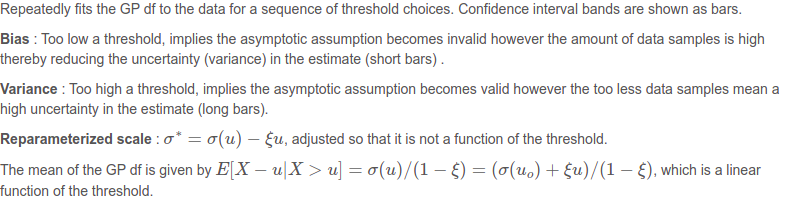
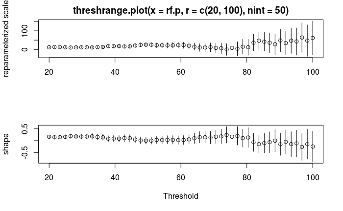
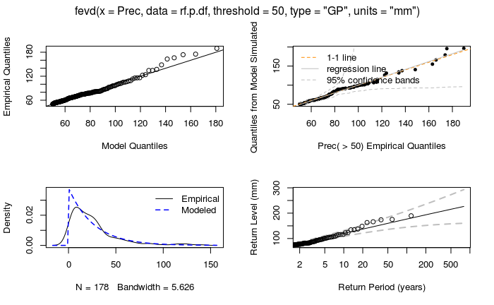

# Application of Bayesian statistics and Extreme Value Theory in estimating return levels 

## Introduction
Estimating extremes of atmospheric variables such as wind speed, temperature and rainfall plays an important role in weather forecasting. Models from classical extreme value theory, such as the generalised extreme value (GEV) or generalised Pareto (GP) distributions, give us limiting models for the tail behaviour of such variables and provide a general template for modelling and extrapolation. The aim of most practical applications is the estimation of the event we might expect to see, on average, once every r years: the so-called r-year return level, commonly notated as zr (with estimate zr).  Some of the most commonly-used solutions result in sample size reduction; for example, the use of filtering schemes to avoid issues of temporal dependence (e.g. peaks over thresholds, or POT), or using only those extremes from within a particular calendar unit to avoid problems associated with seasonal variability.

The extreme climatic events are projected to increase in intensity, frequency and severity over the Indian region in coming decades. From the historical evidences, it can be estimated that the future events
have a potential to inflict severe loss of life and damage to property thereby affecting regional and national economy. Hence, in order to have a robust planning and improved adaptation strategies both at national and sub-national levels, it’s imperative to study the recurrence of climate extremes at city level over different climatic zones of India

## Data
IMD station data for maximum temperature and rainfall for the period 1979 – 2016 are used to estimate 2-,5-,10-,50 and 100- year return levels of temperature and rainfall extremes.

## Discussion
- Return levels of daily maximum temperature and rainfall over the city of Kolkata are estimated using Peak Over Threshold (POT)  and the Block Maxima (BM) approach
- The series obtained using the BM approach is fitted to a Generalized Extreme Value (GEV) distribution

- The series obtained the **POT** approach is fitted to a **Gamme-Pareto Distribution (GPD)** 

- **Threshold Selection** 
Modified Scale and Shape parameters  and Mean Residual Life plot are used to select the appropriate threshold for the analysis of **POT** approach 

- **Declustering**
The concept of Extremal Index (EI) has been used in this study which measures the degree of clustering between the extremes Intervals Estimator automatic declustering technique is applied to estimate the EI
and is found to be ≤05 in all the time series. Thus it is necessary to de-cluster the extremes by choosing the largest event in each cluster before fitting it to the GPD.

